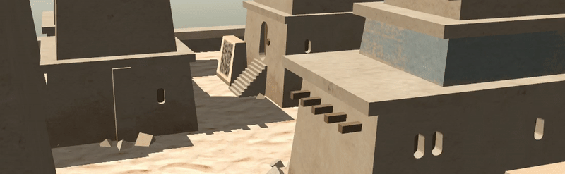
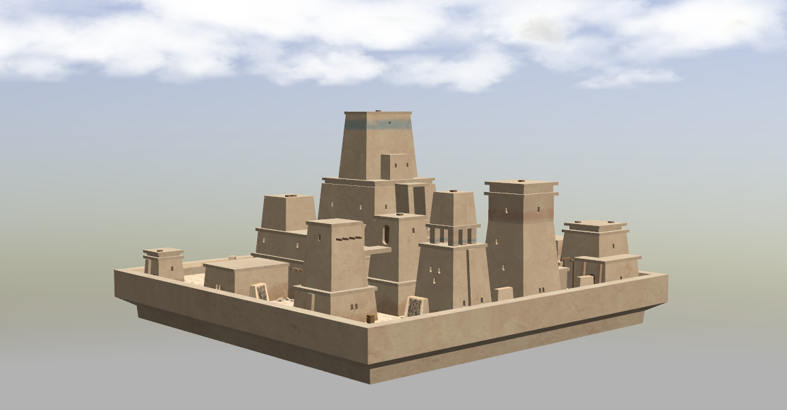

<!-- Written by Nikolay Dema <ndema2301@gmail.com>, September 2022 -->

### Хакатон СтарЛайн 2022

Репозиторий содержит ПО, необходимое для участия в Хакатоне, проводимом
НПО СтарЛайн в 2022 году.

### Работа с симулятором



Симуляция включает модель небольшого, затерянного в песках города и робота,
имеющего на борту rgbd-камеру и лидар.

В качестве симулятора используется [gazebo](https://classic.gazebosim.org/).
В качестве основного фреймворка для разработки используется
[ROS2](https://docs.ros.org/en/galactic/).

Работа с симулятором предполагается внутри docker-контейнера, скрипты и
утилиты для работы с которым предоставляются в составе репозитория.

2. Установите docker:

    Для установки можно воспользоваться скриптом ниже. В случае, если на вашем
    ПК используется видеокарта от nvidia, то обозначенный скрипт следует
    исполнить с параметром **-n** или **--nvidia**. В этом случае на хост
    дополнительно будет установлен NVIDIA Container Toolkit

        bash docker_install.bash

    **Для установки вручную** воспользуйтесь
    [официальной инструкцией установки docker](https://docs.docker.com/install/linux/docker-ce/ubuntu/).
    В случае, если на вашем ПК используется видеокарта от nvidia, то дополнительно
    следует установить [nvidia container toolkit](https://github.com/NVIDIA/nvidia-docker).

    После этой операции следует перезайти в систему для корректной работы docker.


#### Использование docker-контейнера и организация процесса разработки

1. Для работы с докер-контейнером доступны следующие скрипты:

Есть аналогичные zsh скрипты. Там я изменил :nvidia на updated и для Кирилла в bash скрипте general на updated

        ~/ros2_seminars_ws/seminar_4/simulation/docker/run.bash  - запуск контейнера
        ~/ros2_seminars_ws/seminar_4/simulation/docker/into.bash - запуск bash-сессии в контейнере
        ~/ros2_seminars_ws/seminar_4/simulation/docker/stop.bash - остановка контейнера

    
Соответственно, для запуска контейнера запустите скрипт:

        bash ~/ros2_seminars_ws/seminar_4/simulation/docker/run.bash


2. Рабочее окружение colcon расположено в ```simulation/workspace``` и монтируется
внутрь контейнера в корень файловой системы, таким образом разработку можно
вести как внутри, так и вне контейнера.

    Для сборки пакетов откройте новую bash-сессию в контейнере, перейдите в
    директорию окружения и выполните соответствующую команду:

        bash simulation/docker/into.bash
        cd /workspace
        colcon build --symlink-install

    **После первой сборки окружения требуется переоткрыть bash-сессию в контейнере,
    чтобы собранные пакеты стали видимы в системе.**


#### Описание предоставляемого ПО

Для запуска симуляции воспользуйтесь launch-файлом из пакета survey:

    ros2 launch survey ozyland.launch.py

После этого в окне gazebo вы должны увидеть примерно следующую картинку:


## для запуска ноды для анализа qr-кодов используйте следующую команду внутри контейнера

    python3 /workspace/star/src/qr_decoder.py